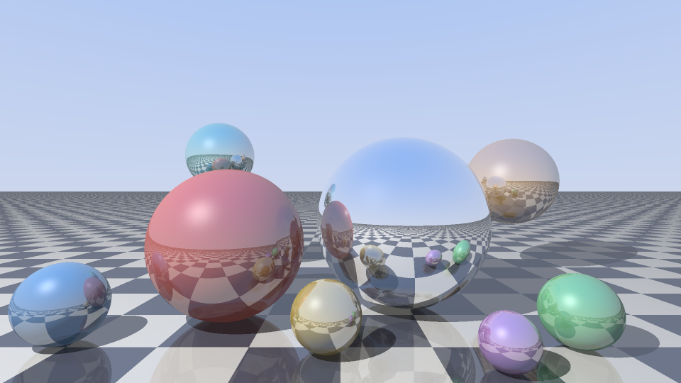

# The Fable Programming Language

Fable is a statically-typed, garbage-collected programming language with
algebraic data types, exhaustive pattern matching, closures, and generics —
implemented from scratch in Rust with **zero dependencies**. It is designed
to be written fluently by AI as much as by hand: deterministic, golden-test
first, and spec-ruled, so a program's behavior is legible and checkable.

```fable
enum Shape {
    Circle(Float),
    Rect(Float, Float),
}

fn area(s: Shape) -> Float {
    match s {
        Shape.Circle(r) -> math.pi * r * r,
        Shape.Rect(w, h) -> w * h,
    }
}

let shapes = [Shape.Circle(1.0), Shape.Rect(3.0, 4.0)];
let total = shapes.map(|s| area(s)).fold(0.0, |a, x| a + x);
println("total area: {total.to_fixed(2)}");
```

Everything here — lexer, parser, unification-based type inference, Maranget
exhaustiveness checking, bytecode compiler, stack VM, mark-and-sweep garbage
collector, REPL, formatter, language server, and disassembler — lives in
about 22,500 lines of dependency-free Rust in `src/`. It is pinned down by
309 golden spec tests (every one a runnable Fable program), a book whose 134
snippets execute in CI, and seventeen demo programs whose complete output is
golden-tested. This image is Fable output too:

<p align="center">
  
</p>
<p align="center">
  <sub>A Whitted raytracer in ~190 lines of Fable
  (<a href="docs/assets/hero.fable">docs/assets/hero.fable</a>):
  mirror reflections, shadows, specular highlights, 2×2 supersampling.
  Reproduce it: <code>fable run docs/assets/hero.fable > hero.ppm</code></sub>
</p>

## The language

- **Real type inference.** `let xs = [1, 2, 3];` — types flow through
  generics, lambdas, and collections. `xs.map(|n| n * 2)` needs no
  annotations; genuinely ambiguous programs get a targeted error instead of
  a guess.
- **Pattern matching that's checked.** A `match` missing a case is a compile
  error *with a concrete witness*: `the value Shape.Rect(_, _) is not
  covered`. Unreachable arms warn. Or-patterns, guards, nested
  destructuring, and struct patterns all participate — and patterns work in
  `let` and `for` heads too: `for (i, x) in xs.enumerate() { ... }`. `if let`
  and `while let` test a single pattern without the ceremony of a full
  `match` — both are sugar for it, so they inherit its exhaustiveness and
  type rules for free.
- **Closures done properly.** Lua-style upvalues: captured variables are
  shared by reference, live past their scope, and close automatically — two
  closures over one `let mut` counter see each other's increments.
- **Methods on your own types.** `impl Point { fn len(self) -> Float
  { ... } }` — generic impls, dot-syntax dispatch, and operator overloading
  (`a + b` dispatches to `a.add(b)`; equality stays structural).
- **Ergonomic error handling.** `Option`/`Result` with combinators, the `?`
  operator for both, and `try(f)` to catch a runtime panic as
  `Err(message)` with the VM stack fully restored — even a stack overflow.
- **Multi-file programs.** `import geo;` with diamond dedup, cycle
  detection, private-by-default items under `pub`, and a `FABLE_PATH`
  search path.
- **Tail-call optimization.** Calls in tail position reuse the frame — the
  Lisp interpreter in `demos/lisp` runs a 100,000-iteration tail-recursive
  Lisp loop in constant stack *through* its own eval.
- **String interpolation.** `"sum = {a + b}"` with arbitrary nested
  expressions — including nested strings with their own interpolations.
- **Systems and binary data.** Bitwise operators (`& | ^ << >>`, plus
  compound assignment `&= |= ^= <<= >>=`) and Int intrinsics (`count_ones`,
  `ushr`, `to_hex`, `wrapping_add`/`sub`/`mul`, …), plus a `Bytes` buffer
  with little- and big-endian pushers and readers up to 64 bits for
  building wire formats, files, and checksums by hand — the `png` and
  `synthwave` demos write real PNG and WAV. Hex/binary literals name the
  full 64-bit bit pattern, so `0x8080808080808080` is as writable as `1`.
- **Parallelism as a first-class citizen.** `worker.spawn` runs a whole
  Fable program on its own OS thread with its own heap, communicating over
  string channels — shared-nothing isolates with panic isolation. `recv`
  blocks; `try_recv` doesn't, for a parent polling several workers without
  picking one to wait on. Plus a native `fft` namespace (with a `magnitude`
  helper) and a feature-gated `gpu` compute path.
- **Batteries.** 150+ built-in methods across `List`, `Map`, `String`,
  `Bytes`, `Option`, `Result`, `Range` (short-circuiting `any`/`all`),
  `Int`, `Float`; `math`/`fs`/`os`/`fft` namespaces (Result-based and
  `?`-friendly); and an embedded standard library — `import std.json;` —
  written in Fable itself: json (with ergonomic construction), flags, path,
  strings (with a `Builder`), lazy iterators, deferred/memoized `Lazy[T]`
  values, and the `set`/`deque`/`lists` collections (including key-based
  `min_by_key`/`max_by_key`).

## The toolchain

- **A test runner.** `fable test dir/` — any `.fable` file with
  `//? expect/error/panic` directives is a golden test; the interpreter's
  own 309-test suite runs through the same command's code. `--bless`
  rewrites a mismatched `//? expect:` line in place when the value changed
  but the print statements around it didn't, instead of making you retype it.
- **A language server.** `fable lsp` — diagnostics as you type, hover
  types, go-to-definition across modules, and completion that works
  mid-edit. JSON-RPC hand-rolled; still zero dependencies.
- **A REPL** with persistent incremental compilation, working imports, and
  `:type`; plus a comment-preserving formatter (`fmt`) and a bytecode
  disassembler (`dis`).
- **Self-contained binaries.** `fable build dir/` staples a program — its
  modules, data files, and worker `.fable`s — onto the interpreter as an
  appended payload, producing one executable that needs no `fable` and no
  source tree. Cross-target by design: every release ships the whole
  [demo zoo](demos/#the-demo-zoo--download-and-run) built for `x86_64` and
  `aarch64` Linux and Windows, plus Apple Silicon macOS (where the payload
  rides in a Mach-O section rather than appended, so it stays code-signable).
- **Rust-quality diagnostics** everywhere, with stable codes, multi-span
  labels, and targeted hints (write `{}` for an empty map and the error
  tells you the literal is `{:}`):

  ```text
  error[E0301]: type mismatch
    --> demo.fable:3:18
     |
   3 |     let x: Int = "hi";
     |            ---   ^^^^ expected `Int`, found `String`
     |            expected due to this
  ```

## The receipts

- **A real GC, stress-tested.** Tracing mark-and-sweep with checkpoint
  rooting. Run anything with `FABLE_GC_STRESS=1` to collect before *every*
  allocation — the entire test suite passes under it.
- **An executable book.** All 134 runnable snippets in [`book/`](book/)
  execute in CI — including the deliberate-error demos, verified to fail
  the way the prose says they do.
- **Seventeen golden-tested demos.** [`demos/`](demos/) holds a mini-Lisp, a
  spreadsheet with cycle detection, a regex engine, a dungeon generator, a
  static site generator, a CSV query language, checkers (a complete 106-ply
  self-play game, every move and node count pinned), an SVG plotter
  (the committed [spirograph](demos/plot/spirograph.svg) is its
  golden-tested output), a sudoku solver, wave-function collapse, a
  from-scratch PNG encoder, a chiptune WAV renderer, an FFT chord analyzer, a
  worker-pool scheduler, an Othello bitboard engine, a Bloom filter, and a
  parallel Mandelbrot — all deterministic, byte-exact, in CI, normal and
  under GC stress. The house style they codify is in
  [`demos/STYLE.md`](demos/STYLE.md).
- **A field-tested design.** The demos are written with orders to report
  every papercut; independent authors hit the same walls, and the language
  removed them — including one genuine RNG bug their tests caught. The triage
  ledgers (fixed / documented / declined-with-reasons) are in
  [`demos/NOTES.md`](demos/NOTES.md).
- **Measured performance.** Every hot path is benchmarked
  ([`bench/`](bench/)); the efficiency pass cut the heaviest demo's runtime
  ~15% and string building ~55%, all with byte-identical output. Numbers and
  method: [`bench/RESULTS.md`](bench/RESULTS.md).

## Try it

```sh
cargo build --release

# Run a program
./target/release/fable examples/mandelbrot.fable

# A raytracer written in Fable (writes a PPM image)
./target/release/fable examples/raytracer.fable > scene.ppm

# Watch checkers play itself — negamax, ~500k nodes, forced captures
./target/release/fable demos/checkers/main.fable

# A Lisp, running inside Fable, running inside Rust
./target/release/fable demos/lisp/main.fable

# Query a CSV like a database
./target/release/fable demos/csvql/main.fable \
  "select city, pop where continent == Asia order by pop desc limit 3"

# Golden-test the spec suite and all seventeen demos with the built-in runner
./target/release/fable test tests/spec demos

# Poke at the machinery
./target/release/fable dis examples/algorithms.fable
./target/release/fable repl
```

```text
fable> let double = |x: Int| x * 2;
fable> [1, 2, 3].map(double)
[2, 4, 6] : List[Int]
fable> :type |acc: Int, x: Int| acc + x
: fn(Int, Int) -> Int
```

## A four-minute tour

```fable
// Bindings are immutable unless marked `mut`; types are inferred.
let name = "Aesop";
let mut count = 0;

// Functions declare parameter types; everything else is inferred.
fn fib(n: Int) -> Int {
    if n < 2 { n } else { fib(n - 1) + fib(n - 2) }
}

// Generics use explicit brackets and infer at call sites.
fn largest[T](xs: List[T], better: fn(T, T) -> Bool) -> Option[T] {
    xs.fold(None, |best, x| match best {
        None -> Some(x),
        Some(b) -> if better(x, b) { Some(x) } else { Some(b) },
    })
}
println(largest([3, 1, 4, 1, 5], |a, b| a > b));   // Some(5)

// Structs are nominal records with reference semantics.
struct Point { x: Float, y: Float }
let p = Point { x: 1.0, y: 2.0 };
p.x += 10.0;

// Enums + match: exhaustiveness is enforced at compile time.
enum Tree {
    Leaf(Int),
    Node(Tree, Tree),
}

// Methods live in impl blocks; `self` is the receiver.
impl Tree {
    fn sum(self) -> Int {
        match self {
            Tree.Leaf(v) -> v,
            Tree.Node(l, r) -> l.sum() + r.sum(),
        }
    }
}

// Option and Result are built in, with combinators and the `?` operator.
let n = "42".parse_int().map(|v| v * 2).unwrap_or(0);
fn add_parsed(a: String, b: String) -> Option[Int] {
    Some(a.parse_int()? + b.parse_int()?)
}

// Collections know functional and imperative tricks alike.
let squares = (1..=10).map(|n| n * n).filter(|n| n % 2 == 0);
let index: Map[String, Int] = {:};
index["one"] = 1;

// Loops destructure their elements; match arms can exit early.
for (i, sq) in squares.enumerate() {
    match sq {
        100 -> break,
        _ -> println("{i}: {sq}"),
    }
}
```

More in the [book](book/) — from a guided tour through the standard library
reference to a chapter on how the VM works.

## Project layout

```
src/
  lexer.rs        tokens, nested string interpolation, comments
  parser.rs       recursive descent → AST (error-recovering)
  check.rs        inference, generics, name resolution, mutability
  patterns.rs     exhaustiveness/reachability (Maranget usefulness)
  compiler.rs     AST → bytecode (closures, match compilation)
  vm.rs           the stack machine + GC checkpoint rooting
  value.rs        heap objects, mark-and-sweep collector
  natives.rs      the built-in function/method implementations
  builtins.rs     their type schemes (shared with the checker)
  fft.rs          the native FFT kernel (radix-2 + Bluestein)
  worker.rs       OS-thread worker isolates and their channels
  gpu.rs          GPU compute dispatch: native Metal / Vulkan / OpenCL
                  backends (zero-dep raw FFI) + wgpu behind --features gpu
  vk.rs           raw-FFI Vulkan compute + the shared Vulkan primitives
  cl.rs           raw-FFI OpenCL compute (SPIR-V via clCreateProgramWithIL)
  mtl.rs, objc.rs raw-FFI Metal + Objective-C shared cores (macOS)
  bundle.rs       fable build: staple a program into a standalone binary
  fmt.rs          comment-preserving, width-aware formatter
  repl.rs         incremental REPL with rollback
  modules.rs      the import loader (dedup, cycles, FABLE_PATH, std)
  testing.rs      the golden-test runner (fable test + the spec suite)
  lsp.rs          the language server (diagnostics, hover, definition)
  jsonlite.rs     hand-rolled JSON for JSON-RPC
  stdlib.rs       embeds std/*.fable into the binary
  dis.rs          disassembler
std/              the standard library, written in Fable
docs/SPEC.md      the normative language specification
book/             the Fable book (every snippet runs in CI)
tests/spec/       golden tests (expect / error / panic directives)
examples/         mandelbrot, raytracer, game of life, brainfuck,
                  JSON parser, algorithms, a tiny text adventure
demos/            seventeen field-test programs (lisp, checkers, sudoku,
                  png, synthwave, reversi, swarm, ...) + STYLE.md, NOTES.md
ports/            transpilation layers + ports (jsl: ICAA; pyl: claudewave)
bench/            the benchmark harness and results
CLAUDE.md         project memory: purpose, invariants, release ledger
```

## Testing

```sh
cargo test                      # unit tests + the golden spec suite
FABLE_GC_STRESS=1 cargo test    # same, collecting before every allocation
```

Golden tests are plain Fable programs with expectations in comments:

```fable
println(1 + 2 * 3);   //? expect: 7
let x: Int = "no";    //? error: type mismatch
[1, 2][9];            //? panic: out of bounds
```

## Status

Fable is a complete, working language. The spec (`docs/SPEC.md`) is the
source of truth; deviations are bugs. It has grown through eight releases —
the core language and toolchain (v0.1–v0.5), a field-test pass that removed
the walls real demo programs hit (v0.6), an infrastructure release that
added `Bytes`, native FFT, worker isolates, bitwise operators, a GPU path,
and a standard-library collections layer, then a measured efficiency pass
over the interpreter and `fable build` — self-contained single-file binaries,
shipped as a demo zoo cross-compiled for Linux, Windows, and macOS (v0.7) —
and a release that worked directly through the demo round's own
deduplicated feature-request queue: `if let`/`while let`, bitwise compound
assignment, 64-bit hex literals and `Bytes` accessors, wrapping arithmetic,
`Range.any`/`all`, non-blocking `worker.try_recv`, a `std.lazy` module,
ergonomic `std.json` construction, and `fable test --bless` (v0.8).
Features are pulled in by real use, not pushed by a roadmap; the per-release
detail is in [`CHANGELOG.md`](CHANGELOG.md), and the project's purpose and
invariants in [`CLAUDE.md`](CLAUDE.md).

What remains out of scope — full traits, per-field visibility, a package
manager, a debugger — stays out until real programs demand it; a language
grows better from the pull of its users than the push of its builder.

## License

Apache License 2.0 — see [LICENSE](LICENSE) and [NOTICE](NOTICE).
Copyright (c) 2026 Roxy Alessandra Williams-Lalonde, pending formal
registration of Alterna Systems LLC.
