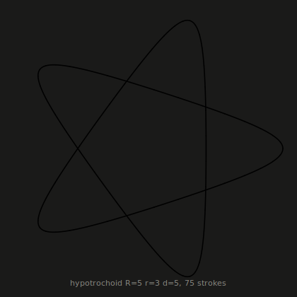

# The Fable Programming Language

Fable is a statically-typed, garbage-collected programming language with
algebraic data types, exhaustive pattern matching, closures, and generics —
implemented from scratch in Rust with **zero dependencies**.

```fable
enum Shape {
    Circle(Float),
    Rect(Float, Float),
}

fn area(s: Shape) -> Float {
    match s {
        Shape.Circle(r) -> math.pi * r * r,
        Shape.Rect(w, h) -> w * h,
    }
}

let shapes = [Shape.Circle(1.0), Shape.Rect(3.0, 4.0)];
let total = shapes.map(|s| area(s)).fold(0.0, |a, x| a + x);
println("total area: {total.to_fixed(2)}");
```

Everything here — lexer, parser, unification-based type inference, Maranget
exhaustiveness checking, bytecode compiler, stack VM, mark-and-sweep garbage
collector, REPL, formatter, language server, and disassembler — lives in
about 18,000 lines of dependency-free Rust in `src/`. It is pinned down by
262 golden spec tests (every one a runnable Fable program), a book whose 112
snippets execute in CI, and ten demo programs whose complete output is
golden-tested — including this spirograph, drawn by `demos/plot`:

<p align="center">
  
</p>

## The language

- **Real type inference.** `let xs = [1, 2, 3];` — types flow through
  generics, lambdas, and collections. `xs.map(|n| n * 2)` needs no
  annotations; genuinely ambiguous programs get a targeted error instead of
  a guess.
- **Pattern matching that's checked.** A `match` missing a case is a compile
  error *with a concrete witness*: `the value Shape.Rect(_, _) is not
  covered`. Unreachable arms warn. Or-patterns, guards, nested
  destructuring, and struct patterns all participate — and patterns work in
  `let` and `for` heads too: `for (i, x) in xs.enumerate() { ... }`.
- **Closures done properly.** Lua-style upvalues: captured variables are
  shared by reference, live past their scope, and close automatically — two
  closures over one `let mut` counter see each other's increments.
- **Methods on your own types.** `impl Point { fn len(self) -> Float
  { ... } }` — generic impls, dot-syntax dispatch, and operator overloading
  (`a + b` dispatches to `a.add(b)`; equality stays structural).
- **Ergonomic error handling.** `Option`/`Result` with combinators, the `?`
  operator for both, and `try(f)` to catch a runtime panic as
  `Err(message)` with the VM stack fully restored — even a stack overflow.
- **Multi-file programs.** `import geo;` with diamond dedup, cycle
  detection, private-by-default items under `pub`, and a `FABLE_PATH`
  search path.
- **Tail-call optimization.** Calls in tail position reuse the frame — the
  Lisp interpreter in `demos/lisp` runs a 100,000-iteration tail-recursive
  Lisp loop in constant stack *through* its own eval.
- **String interpolation.** `"sum = {a + b}"` with arbitrary nested
  expressions — including nested strings with their own interpolations.
- **Batteries.** 100+ built-in methods across `List`, `Map`, `String`,
  `Option`, `Result`, `Range`, `Int`, `Float`; `math`/`fs`/`os` namespaces
  (Result-based and `?`-friendly); and an embedded standard library —
  `import std.json;` — written in Fable itself: json, flags, path, strings,
  and lazy iterators.

## The toolchain

- **A test runner.** `fable test dir/` — any `.fable` file with
  `//? expect/error/panic` directives is a golden test; the interpreter's
  own 262-test suite runs through the same command's code.
- **A language server.** `fable lsp` — diagnostics as you type, hover
  types, go-to-definition across modules, and completion that works
  mid-edit. JSON-RPC hand-rolled; still zero dependencies.
- **A REPL** with persistent incremental compilation, working imports, and
  `:type`; plus a comment-preserving formatter (`fmt`) and a bytecode
  disassembler (`dis`).
- **Rust-quality diagnostics** everywhere, with stable codes, multi-span
  labels, and targeted hints (write `{}` for an empty map and the error
  tells you the literal is `{:}`):

  ```text
  error[E0301]: type mismatch
    --> demo.fable:3:18
     |
   3 |     let x: Int = "hi";
     |            ---   ^^^^ expected `Int`, found `String`
     |            expected due to this
  ```

## The receipts

- **A real GC, stress-tested.** Tracing mark-and-sweep with checkpoint
  rooting. Run anything with `FABLE_GC_STRESS=1` to collect before *every*
  allocation — the entire test suite passes under it.
- **An executable book.** All 112 runnable snippets in [`book/`](book/)
  execute in CI — including the deliberate-error demos, verified to fail
  the way the prose says they do.
- **Ten golden-tested demos.** [`demos/`](demos/) holds a mini-Lisp, a
  spreadsheet with cycle detection, a regex engine, a dungeon generator, a
  static site generator, a CSV query language, checkers (a complete 106-ply
  self-play game, every move and node count pinned), an SVG plotter, a
  sudoku solver, and wave-function collapse — deterministic, byte-exact,
  in CI.
- **A field-tested design.** The demos were written with orders to report
  every papercut; ten independent authors hit the same dozen walls, and
  v0.6 is those walls removed — plus one genuine RNG bug their tests
  caught. The triage ledger (fixed / documented / declined-with-reasons)
  is [`demos/NOTES.md`](demos/NOTES.md); the story is
  [book chapter 10](book/10-field-test.md).

## Try it

```sh
cargo build --release

# Run a program
./target/release/fable examples/mandelbrot.fable

# A raytracer written in Fable (writes a PPM image)
./target/release/fable examples/raytracer.fable > scene.ppm

# Watch checkers play itself — negamax, ~500k nodes, forced captures
./target/release/fable demos/checkers/main.fable

# A Lisp, running inside Fable, running inside Rust
./target/release/fable demos/lisp/main.fable

# Query a CSV like a database
./target/release/fable demos/csvql/main.fable \
  "select city, pop where continent == Asia order by pop desc limit 3"

# Golden-test the spec suite and all ten demos with the built-in runner
./target/release/fable test tests/spec demos

# Poke at the machinery
./target/release/fable dis examples/algorithms.fable
./target/release/fable repl
```

```text
fable> let double = |x: Int| x * 2;
fable> [1, 2, 3].map(double)
[2, 4, 6] : List[Int]
fable> :type |acc: Int, x: Int| acc + x
: fn(Int, Int) -> Int
```

## A four-minute tour

```fable
// Bindings are immutable unless marked `mut`; types are inferred.
let name = "Aesop";
let mut count = 0;

// Functions declare parameter types; everything else is inferred.
fn fib(n: Int) -> Int {
    if n < 2 { n } else { fib(n - 1) + fib(n - 2) }
}

// Generics use explicit brackets and infer at call sites.
fn largest[T](xs: List[T], better: fn(T, T) -> Bool) -> Option[T] {
    xs.fold(None, |best, x| match best {
        None -> Some(x),
        Some(b) -> if better(x, b) { Some(x) } else { Some(b) },
    })
}
println(largest([3, 1, 4, 1, 5], |a, b| a > b));   // Some(5)

// Structs are nominal records with reference semantics.
struct Point { x: Float, y: Float }
let p = Point { x: 1.0, y: 2.0 };
p.x += 10.0;

// Enums + match: exhaustiveness is enforced at compile time.
enum Tree {
    Leaf(Int),
    Node(Tree, Tree),
}

// Methods live in impl blocks; `self` is the receiver.
impl Tree {
    fn sum(self) -> Int {
        match self {
            Tree.Leaf(v) -> v,
            Tree.Node(l, r) -> l.sum() + r.sum(),
        }
    }
}

// Option and Result are built in, with combinators and the `?` operator.
let n = "42".parse_int().map(|v| v * 2).unwrap_or(0);
fn add_parsed(a: String, b: String) -> Option[Int] {
    Some(a.parse_int()? + b.parse_int()?)
}

// Collections know functional and imperative tricks alike.
let squares = (1..=10).map(|n| n * n).filter(|n| n % 2 == 0);
let index: Map[String, Int] = {:};
index["one"] = 1;

// Loops destructure their elements; match arms can exit early.
for (i, sq) in squares.enumerate() {
    match sq {
        100 -> break,
        _ -> println("{i}: {sq}"),
    }
}
```

More in the [book](book/) — from a guided tour through the standard library
reference to a chapter on how the VM works.

## Project layout

```
src/
  lexer.rs        tokens, nested string interpolation, comments
  parser.rs       recursive descent → AST (error-recovering)
  check.rs        inference, generics, name resolution, mutability
  patterns.rs     exhaustiveness/reachability (Maranget usefulness)
  compiler.rs     AST → bytecode (closures, match compilation)
  vm.rs           the stack machine + GC checkpoint rooting
  value.rs        heap objects, mark-and-sweep collector
  natives.rs      the built-in function/method implementations
  builtins.rs     their type schemes (shared with the checker)
  fmt.rs          comment-preserving formatter
  repl.rs         incremental REPL with rollback
  modules.rs      the import loader (dedup, cycles, FABLE_PATH, std)
  testing.rs      the golden-test runner (fable test + the spec suite)
  lsp.rs          the language server (diagnostics, hover, definition)
  jsonlite.rs     hand-rolled JSON for JSON-RPC
  stdlib.rs       embeds std/*.fable into the binary
  dis.rs          disassembler
std/              the standard library, written in Fable
docs/SPEC.md      the normative language specification
book/             the Fable book (every snippet runs in CI)
tests/spec/       golden tests (expect / error / panic directives)
examples/         mandelbrot, raytracer, game of life, brainfuck,
                  JSON parser, algorithms, a tiny text adventure
demos/            ten field-test programs (lisp, spreadsheet, regex,
                  dungeon, mdsite, csvql, checkers, plot, sudoku, wfc)
```

## Testing

```sh
cargo test                      # unit tests + the golden spec suite
FABLE_GC_STRESS=1 cargo test    # same, collecting before every allocation
```

Golden tests are plain Fable programs with expectations in comments:

```fable
println(1 + 2 * 3);   //? expect: 7
let x: Int = "no";    //? error: type mismatch
[1, 2][9];            //? panic: out of bounds
```

## Status

Fable is a complete, working language built as a demonstration project.
The spec (`docs/SPEC.md`) is the source of truth; deviations are bugs.

v0.2 delivered everything v0.1 had declared out of scope — user-defined
methods (`impl` blocks), multi-file modules (`import`), the `?` operator,
and tail-call optimization. v0.3 made it a real glue language: `pub`
visibility, operator methods, a `FABLE_PATH` module search path, and
`fs`/`os` builtins. v0.4 built the toolchain: `fable test`, the embedded
standard library (including lazy iterators written in Fable itself),
`fable lsp`, and catchable panics. v0.5 closed the loop: the REPL imports,
the language server completes, and the book runs in CI.

v0.5 also made a promise: further growth would come from the pull of real
usage, not the push of a roadmap. v0.6 is that pull, cashed in — ten demo
programs field-tested the language, and their reports became the release
(see "The receipts" above, `demos/NOTES.md`, and
[book chapter 10](book/10-field-test.md)).

What remains out of scope — full traits, per-field visibility, a package
manager, a debugger, Windows paths — stays out until real programs demand
it; a language grows better from the pull of its users than the push of
its builder.

## License

Apache License 2.0 — see [LICENSE](LICENSE) and [NOTICE](NOTICE).
Copyright (c) 2026 Roxy Alessandra Williams-Lalonde, pending formal
registration of Alterna Systems LLC.
